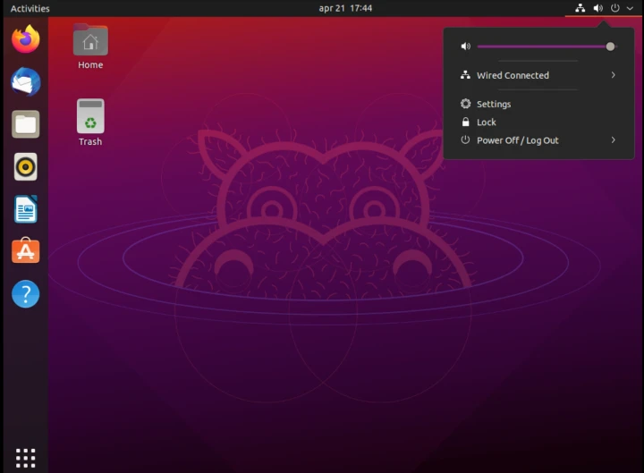
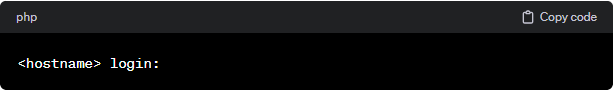
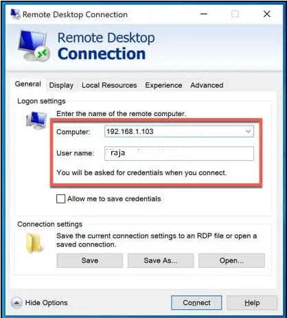
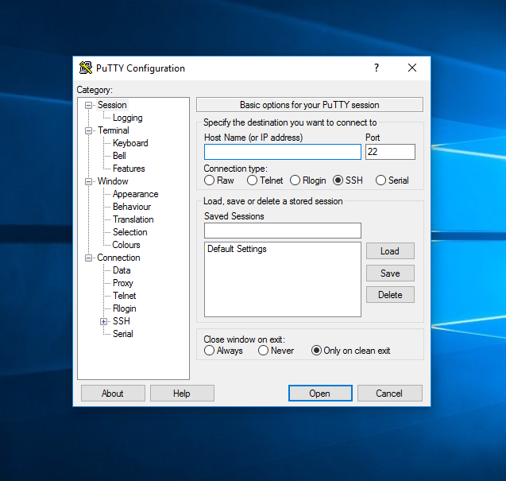

# 01-Log into local & remote graphical and text mode consoles

Linux has become increasingly popular due to its open-source nature and flexibility. It offers a stable and secure environment for developers, equipped with a broad array of tools and applications for various requirements. With the rise of cloud computing and growing concerns over data privacy and security, Linux is now being recognized as a viable option for businesses and organizations around the world.

In this article, we will explore methods to access a Linux system, whether it is located locally or remotely. We will discuss both text-mode and graphical-mode access, providing a comprehensive guide for users.

Logging into a Linux system is quite straightforward, akin to how we log into various applications or websites by entering a username and password. There are four primary methods to log in:

1. Logging into a local Linux system using the local text-mode console.
2. Logging into a local Linux system through the local graphical-mode console.
3. Remotely logging into a Linux system in text-mode.
4. Remotely logging into a Linux system in graphical-mode.

It's common to come across terms such as "console," "virtual terminal," and "terminal emulator." These might sound confusing at first, but they refer to the interfaces through which you interact with the operating system. A console is essentially a screen that displays text from the operating system and allows you to enter commands. A terminal emulator serves a similar purpose but operates within a graphical user interface, allowing you to enter commands through a window on your screen.

The origin of these terms dates back to when computers were a rare and expensive resource, often shared among multiple users in a university or research setting through physical consoles or terminals. This was a cost-effective way to provide computing access to many users.

In the Linux environment of today, consoles and terminals are mostly software entities. For example, the console is what you see when Linux boots up and displays system messages. Pressing <strong>CTRL+ALT+F2</strong> brings up a virtual terminal. And when you need to enter commands on a Linux system with a graphical user interface, you use a terminal emulator.

## Logging into Local Linux Systems

The term "local" in tech speak simply refers to a device that is physically present with you, like the computer on your desk, in contrast to a "remote" system, such as a server hosted on Google Cloud.

### Local GUI

Linux installed on servers typically forgoes the Graphical User Interface (GUI) to maintain a lean setup, focusing solely on text-based interactions. However, you might encounter servers equipped with a GUI. When you do, logging in is straightforward: the login screen displays a list of users from which you can select yours and then enter your password. Just remember to log out once you're done to maintain security.

### Local Text Console (or Virtual Terminal)

For servers running a standard Linux OS without GUI components, local login remains uncomplicated. You'll be greeted with a login prompt on your screen, inviting you to enter your username and subsequently your password. It's worth noting that as you type your password, no characters will be displayed, which could be disconcerting for first-timers but is a security feature to protect your credentials. Mistyped? No problem—use backspace to correct errors. Finished your session? Simply type `exit` to log out.

## Logging into Remote Linux Systems

Nowadays, with the prevalence of cloud services, logging into remote systems has become the norm.

### Remote GUI

While most Linux servers lack a GUI, exceptions exist. Remote graphical logins can vary since the setup depends on the server's configuration. Options include VNC (Virtual Network Computing) for which you'd need a compatible VNC client like TightVNC or RealVNC, or perhaps an RDP (Remote Desktop Protocol) solution for Windows users, accessible through the "Remote Desktop Connection" application. The process essentially boils down to using the right application to connect to the server's IP address using your username and password.

  

### Logging into Remote Systems with SSH (Text-mode Logins)

For text-based remote connections, SSH (Secure Shell) is the standard, thanks to its secure, encrypted communication protocol, which replaced the insecure telnet. OpenSSH, the implementation of SSH used by millions of servers, ensures that connections are both secure and reliable. 

To connect via SSH, you'll need the IP address of your server. On Linux or macOS, you can use the preinstalled SSH client by opening a terminal and typing a command like `ssh user@192.168.0.17`, replacing "user" with your actual username and "192.168.0.17" with your server's IP address.  

Windows users on versions prior to Windows 10 may need to install an SSH client like PuTTY, while newer versions come with SSH support out of the box.

Whether you're logging in locally or remotely, understanding these basics ensures you can securely access and manage your Linux systems.

